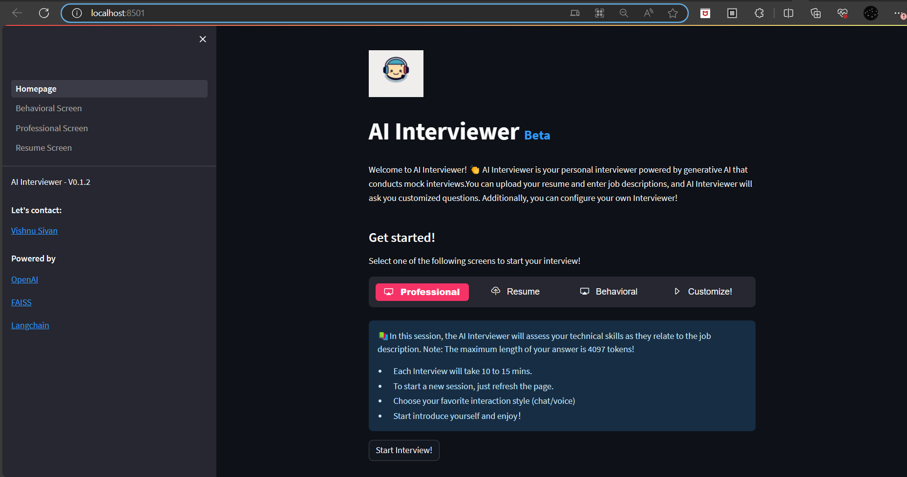
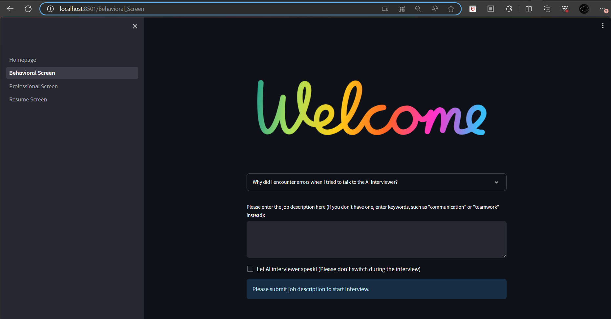
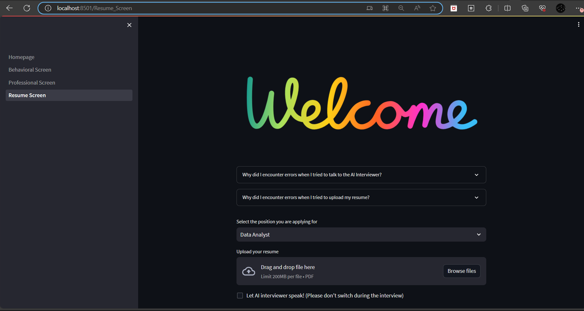

# AI Interviewer 

AI Interviewer is a cutting-edge application powered by generative AI designed to conduct mock interviews. With the ability to analyze your uploaded resume and job descriptions, AI Interviewer generates tailored questions to enhance your interview preparation. You even have the flexibility to customize your own interviewing experience!

## Table of Contents

- [Overview](#overview)
- [Demo](#demo)
- [Getting Started](#getting-started)
- [Features](#features)

## Overview

AI Interviewer aims to revolutionize your interview preparation process. Whether you're seeking to improve your technical skills, communication abilities, or adaptability, this application can assist you. Powered by cutting-edge technology from OpenAI, FAISS, and Langchain, AI Interviewer provides a seamless experience that simulates real interview scenarios.

## Installation

- Create a virtual environment

```
python -m venv venv
venv\Scripts\activate
```
- Install the dependencies

```
pip install -r requirements.txt
```
- Run the app

```
streamlit run Homepage.py
```

## Demo





## Getting Started

To begin your AI Interviewer experience, follow these simple steps:

1. **Select Interview Type:** Choose from the following interview screens:
   - **Homepage:** Overview of AI Interviewer.
   - **Behavioral Screen:** Assess your behavioral skills.
   - **Professional Screen:** Evaluate your technical skills.
   - **Resume Screen:** Review your uploaded resume.
   
2. **Customize Your Experience:** Tailor your interview by uploading your resume and providing job descriptions.

3. **Choose Interaction Style:** Opt for your preferred interaction style, whether it's through chat or voice.

4. **Start Interviewing:** Begin the interview by introducing yourself and responding to AI-generated questions.